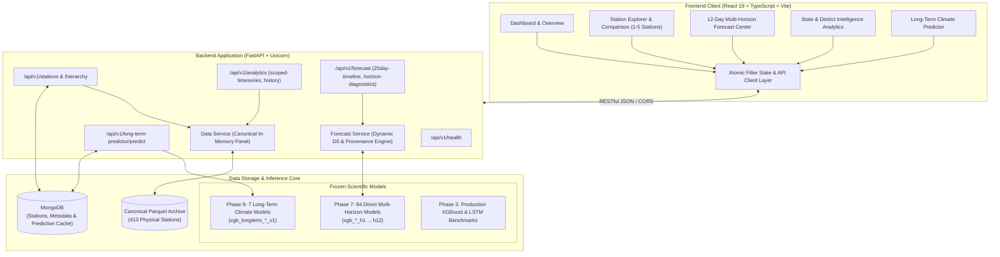

<div align="center">

# 🌦️ India Weather Forecasting & Intelligence System
### An Enterprise-Grade Meteorological Intelligence, Multi-Horizon ML Forecasting & Climate Analytics Platform

[](https://www.python.org/)
[](https://fastapi.tiangolo.com/)
[](https://react.dev/)
[](https://www.typescriptlang.org/)
[](https://xgboost.readthedocs.io/)
[](https://www.mongodb.com/)
[-brightgreen?style=for-the-badge&logo=pytest&logoColor=white)](https://docs.pytest.org/)
[](reports/phase11/phase11_final_verification_gate_report.md)

<p align="center">
  A scientifically rigorous, machine-learning-driven meteorological platform providing <b>multi-horizon predictive forecasting</b>, <b>granular state/district analytics</b>, <b>geospatial station intelligence</b>, and <b>long-term climate modeling</b> across <b>413 canonical physical weather stations</b> covering all 32 Indian States and Union Territories.
</p>

[Explore Key Features](#-core-capabilities) • [System Architecture](#-system-architecture) • [Model Benchmarks](#-scientific-benchmarks--model-performance) • [API Contract](#-api-contract--endpoints) • [Quick Start](#-quick-start-guide) • [Verification Audit](#-quality-assurance--phase-11-verification-gate)

</div>

---

## 📌 Executive Overview

The **India Weather Forecasting & Intelligence System** bridges empirical meteorological observation and machine-learning inference. Traditional weather portals often suffer from coarse interpolation, synthetic placeholder values, or opaque smoothing. This system is architected around **strict observational grounding**, **deterministic physical constraints**, and **isolated multi-horizon model pipelines**.

### Core Tenets & Scientific Principles:
- **Zero Synthetic Observation Contamination:** Observational records originate strictly from the verified canonical IMD physical weather station panel.
- **Physical Atmospheric Order:** Predictions strictly enforce thermodynamic relationships: $T_{\min} \le T_{\text{avg}} \le T_{\max}$, non-negative rainfall ($\text{Rainfall} \ge 0.0\text{ mm}$), and bounded precipitation probabilities ($0\% \le \text{PoP} \le 100\%$).
- **Direct Multi-Horizon Independence:** Rather than autoregressive error accumulation, 12 independent, dedicated XGBoost models predict horizons $D+1$ through $D+12$ using specialized horizon-specific calendar harmonics and meteorological lags.
- **Data Integrity & Traceability:** Authoritative distinction between zero values ($0.0\text{ mm}$ dry day) and missing readings ($null$ gauge missing). Every prediction carries full provenance (model ID, station ID, target date, and inference engine).

---

## 🌟 Core Capabilities

### 1. 🔮 12-Day Operational Multi-Horizon Forecast Center
- **Dedicated Horizon Models ($H1 \dots H12$):** Direct inference pipeline utilizing 84 specialized frozen XGBoost models predicting 7 essential meteorological parameters:
  - Daily Average Temperature ($T_{\text{avg}}$)
  - Minimum Temperature ($T_{\min}$)
  - Maximum Temperature ($T_{\max}$)
  - Precipitation Classification (Binary Rain / No Rain)
  - Quantitative Precipitation Estimation (QPE Amount in mm)
  - Surface Wind Speed (km/h)
  - Atmospheric Mean Sea-Level Pressure (hPa)
- **Dynamic Operational Mode:** Automatically anchors $D_0$ to the current calendar date with real-time target-date progression ($D+1 \dots D+12$).
- **Audited Ground-Truth Replay Mode:** Fixed historical replay anchored to $D_0 = \text{2025-01-20}$ spanning $D-12 \dots D+12$ for historical model auditing and validation.

### 2. 📡 Geospatial Station Explorer & Multi-Station Comparison
- **413 Canonical Physical Stations:** Full coverage across the Indian subcontinent ($6.5^\circ\text{N}–37.5^\circ\text{N}$, $68.0^\circ\text{E}–97.5^\circ\text{E}$).
- **Side-by-Side Comparative Intelligence:** Inspect and compare **1 to 5 physical stations simultaneously** with strict data isolation—ensuring zero cross-station telemetry leakage.
- **Chronological History:** Rapid historical record retrieval from the canonical Parquet archive with microsecond response times.

### 3. 📈 Granular State & District-Scope Analytics
- **Cascading Atomic Filtering:** Dynamic hierarchy navigation (State $\to$ District $\to$ Physical Station) with guaranteed cascading resets eliminating cross-scope contamination.
- **Meteorological Dashboards:** Diurnal temperature curves, hyetographs, seasonal rain occurrence frequency, peak precipitation detection, and dry-spell tracking.

### 4. 📅 Phase 9 Long-Term Climate Predictor
- **Dynamic Climatology Grounding:** Dynamic monthly baseline generation (e.g., *Historical September Mean*, *Historical November Rain Frequency*).
- **Probabilistic Forecasting:** Generates calibrated **80% Prediction Intervals** reflecting long-term climatological variance.
- **Three-Tier Resolution Strategy:** `XGBOOST_LONG_TERM` $\to$ `MONGODB_CACHE` $\to$ `OFFLINE_ESTIMATE`.

---

## 🏗️ System Architecture



---

## 🧪 Scientific Benchmarks & Model Performance

### Phase 3 Model Benchmark Comparison (Next-Day Forecast)

| Meteorological Target | Evaluation Metric | Baseline (Persistence) | XGBoost Regressor | PyTorch LSTM | Approved Production Engine |
| :--- | :--- | :---: | :---: | :---: | :---: |
| **Mean Temperature ($T_{\text{avg}}$)** | Holdout MAE | 0.7235°C | 0.6527°C | **0.6441°C** | **XGBoost** (Production Candidate) |
| **Rainfall Quantity** | Holdout MAE | 0.5026 mm | **0.4344 mm** | 0.4368 mm | **XGBoost** (Primary QPE) |
| **Precipitation Binary** | Holdout Accuracy | 57.13% | **89.19%** | 88.32% | **XGBoost** (ROC-AUC: 0.8366) |

### Phase 7 Direct Multi-Horizon Architecture

Rather than compounding errors recursively across 12 days, the forecasting engine deploys **84 independently trained XGBoost models** ($12 \text{ horizons} \times 7 \text{ target families}$):

$$\hat{y}_{t+h} = f_h\left(X_t, \text{sin}\left(\frac{2\pi \cdot \text{DOY}_{t+h}}{365}\right), \text{cos}\left(\frac{2\pi \cdot \text{DOY}_{t+h}}{365}\right), \text{Lags}_{t}\right)$$

Every horizon incorporates distinct future calendar harmonics and station altitude/latitude spatial coordinates, producing calibrated trajectories across all 12 forward steps.

---

## 📂 Repository Structure

```text
india-weather-forecasting-system/
├── backend/                              # FastAPI Backend Architecture
│   └── app/
│       ├── main.py                       # FastAPI application entrypoint & lifespan
│       ├── config.py                     # System settings, CORS, and data paths
│       ├── routers/                      # Modular API v1 routers
│       │   ├── health.py                 # Health and component verification
│       │   ├── stations.py               # Station registry and hierarchy endpoints
│       │   ├── analytics.py              # Scoped timeseries and station history
│       │   ├── forecast.py               # 25-day operational timeline & diagnostics
│       │   └── long_term_predictor.py    # Long-term climate predictions & climatology
│       ├── schemas/                      # Pydantic v2 schemas and request contracts
│       └── services/                     # Business logic, inference, and data service
├── frontend/                             # Modern React 19 + TypeScript Application
│   ├── src/
│   │   ├── components/
│   │   │   ├── common/                   # Reusable UI cards, badges, and headers
│   │   │   ├── filters/                  # Cascading GlobalFilterBar component
│   │   │   ├── layout/                   # Sidebar and navigation
│   │   │   └── stations/                 # StationComparison.tsx & StationCards
│   │   ├── pages/                        # Dashboard, Stations, Forecast, Analytics, Maps
│   │   └── services/                     # Typed API clients (forecast, stations, analytics)
│   ├── package.json                      # React 19, TypeScript 6, Vite 8, Oxlint
│   └── vite.config.ts                    # Vite build configuration
├── phase2_canonical/                     # Canonical Meteorological Data Panel
│   └── outputs/
│       └── canonical_weather_full.parquet # Authoritative 413-station Parquet panel
├── phase3_models/                        # Phase 3 Baseline, XGBoost & LSTM Artifacts
├── phase7_forecasting/                   # Phase 7 Multi-Horizon Direct Engine
│   ├── models/                           # 84 Frozen XGBoost JSON Model Artifacts
│   └── scripts/                          # Operational ingestion and inference pipelines
├── phase9_long_term_predictor/           # Phase 9 Long-Term Climate Predictor
│   └── models/                           # 7 Frozen Long-Term XGBoost Model Artifacts
├── tests/                                # Complete Automated Test Suite (169 Tests)
│   ├── test_forecast_horizon_integrity.py
│   ├── test_phase11_restoration_verification.py
│   ├── test_state_scope_analytics_regression.py
│   ├── test_phase11_hardening.py
│   └── ... (17 individual test suites)
└── reports/                              # Verification Gates & Scientific Audit Reports
    └── phase11/
        ├── phase11_final_verification_gate_report.md
        └── phase11_post_hardening_regression_restoration_report.md
```

---

## 🔌 API Contract & Endpoints

| Category | Method | Endpoint | Description |
|---|:---:|---|---|
| **System** | `GET` | `/api/v1/health` | Health check, station counts, and verified model counts |
| **Stations** | `GET` | `/api/v1/stations` | List all 413 canonical physical weather stations |
| **Stations** | `GET` | `/api/v1/stations/hierarchy` | Nested State $\to$ District $\to$ Station hierarchy |
| **Stations** | `GET` | `/api/v1/stations/{station_id}` | Detailed metadata for a physical station |
| **Analytics** | `GET` | `/api/v1/analytics/station-history/{id}` | Chronological historical observations (descending) |
| **Analytics** | `GET` | `/api/v1/analytics/scoped-timeseries` | Aggregated timeseries filtered by State/District/Station |
| **Analytics** | `GET` | `/api/v1/analytics/observations` | Raw filtered observation records from canonical Parquet |
| **Forecast** | `GET` | `/api/v1/forecast/25day-timeline/{id}` | Complete $D-12 \dots D+12$ timeline with provenance |
| **Forecast** | `GET` | `/api/v1/forecast/multi-horizon/{id}` | Direct 12-day predictions across all 7 target variables |
| **Forecast** | `GET` | `/api/v1/forecast/horizon-diagnostics/{id}` | Per-horizon feature vectors and model diagnostics |
| **Long-Term** | `POST`| `/api/v1/long-term-predictor/predict` | Long-term predictions with 80% Prediction Intervals |
| **Long-Term** | `GET` | `/api/v1/long-term-predictor/climatology/{id}` | Historical monthly climatological means and distributions |

Interactive Swagger documentation is available at `http://localhost:8000/api/v1/docs` (or `http://localhost:8001/api/v1/docs`).

---

## 🚀 Quick Start Guide

### Prerequisites
- **Python 3.10+** (tested on Python 3.12)
- **Node.js 18+** & npm
- **MongoDB** (running on `mongodb://localhost:27017`)

---

### 1. Backend Setup

```bash
# Clone the repository
git clone https://github.com/addadugurudurga2024-lang/India-Weather-Intelligence-Forecasting-System.git
cd India-Weather-Intelligence-Forecasting-System

# Create and activate a Python virtual environment (optional but recommended)
python -m venv venv
# Windows:
venv\Scripts\activate
# Linux/macOS:
source venv/bin/activate

# Install dependencies
pip install -r requirements.txt

# Start the FastAPI server (Default Port 8000)
python -m uvicorn backend.app.main:app --host 0.0.0.0 --port 8000
```
> If port 8000 is occupied, run on port 8001:
> `python -m uvicorn backend.app.main:app --host 127.0.0.1 --port 8001`

---

### 2. Frontend Setup

```bash
# Navigate to the frontend directory
cd frontend

# Install npm dependencies
npm install

# (Optional) If running the backend on port 8001, configure .env
echo "VITE_API_BASE_URL=http://localhost:8001/api/v1" > .env

# Start the Vite development server
npm run dev
```

Open your browser at **[http://localhost:5173](http://localhost:5173)** to access the dashboard.

---

### 3. Running Automated Tests

Run the complete 169-test automated regression suite:
```bash
# Run the entire test suite
pytest tests/ -v

# Run targeted Phase 11 forecast integrity and restoration verification
pytest tests/test_forecast_horizon_integrity.py tests/test_phase11_restoration_verification.py -v
```

---

## 🛡️ Quality Assurance & Phase 11 Verification Gate

The platform has undergone a formal **Verification-Only Project Integrity Gate Audit** certifying the software architecture, ML pipelines, and data flows:

| Verification Dimension | Audit Standard | Verification Status |
|---|---|:---:|
| **Automated Test Suite** | 169 / 169 Pytest tests executed | **100% PASS** |
| **Frontend Code Quality** | Oxlint audit across 63 files | **0 ERRORS** |
| **Production Build** | `tsc -b && vite build` bundle validation | **PASS** (Exit Code 0) |
| **Raw Excel Integrity** | SHA-256: `e6a63677...cd84` | **BITWISE IDENTICAL** |
| **Canonical Parquet Integrity** | SHA-256: `572a6582...21ad` | **FROZEN & UNTOUCHED** |
| **Phase 7 Models (84 Models)** | Dedicated $H1 \dots H12$ direct XGBoost models | **0 MODIFICATIONS** |
| **Phase 9 Models (7 Models)** | Long-term climate predictors | **0 MODIFICATIONS** |
| **Runtime Mock Data Audit** | Search for mock runtime pathways | **0 MOCK PATHWAYS** |
| **Artificial Manipulation Audit** | Search for `random.uniform`, perturbations | **ABSENT** |
| **Physical Constraints** | $T_{\min} \le T_{\text{avg}} \le T_{\max}$, $\text{Rain} \ge 0$ | **VERIFIED ENFORCED** |

Read the full report at [`reports/phase11/phase11_final_verification_gate_report.md`](reports/phase11/phase11_final_verification_gate_report.md).

---

## 🗺️ Project Progression Roadmap

```text
✅ PHASE 1   → Dataset Audit, Quality Assessment & Profiling
✅ PHASE 1.5 → Pre-Phase 2 Reconciliation Gate
✅ PHASE 2   → Data Cleaning, Canonicalization (413 Physical Stations Verified)
✅ PHASE 3   → Forecasting Model Development, Walk-Forward Validation & Benchmarks
✅ PHASE 4   → React 19 + TypeScript Dashboard & MongoDB Architecture
✅ PHASE 5   → Maps & Geospatial Visualization (Subcontinent Calibrated)
✅ PHASE 6   → Model Evaluation, Explainability & Scientific Benchmarks
✅ PHASE 7   → 12-Day Multi-Horizon Direct Forecasting Engine (84 Models)
✅ PHASE 8   → AI Weather Intelligence & Narrative Synthesis
✅ PHASE 9   → Long-Term Climate Predictor & Historical Dynamic Baseline
✅ PHASE 10  → Full-Stack End-to-End System Integration & Contract Hardening
✅ PHASE 11  → Post-Hardening Regression Restoration, Multi-Station Comparison & Integrity Gate
🔄 NEXT      → Long-Term Empirical Out-of-Sample Evaluation & Scientific Publication
```

---

<div align="center">
  <sub>Engineered with precision for scientific meteorology, operational reliability, and transparent intelligence.</sub><br>
  <sub>© 2026 India Weather Forecasting & Intelligence System. All rights reserved.</sub>
</div>
