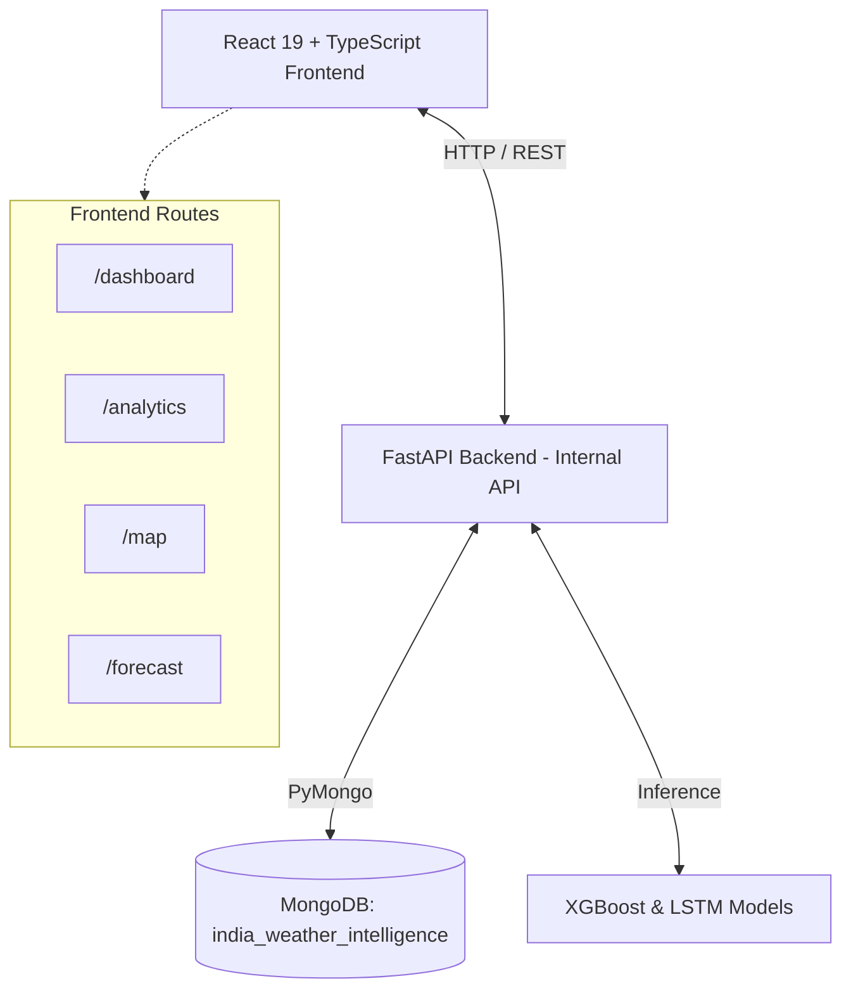

<div align="center">
  <h1>🌦️ India Weather Forecasting & Intelligence System</h1>
  <p>A production-oriented, scientific weather intelligence and forecasting platform covering <b>413 canonical physical weather stations</b> across 32 Indian States and Union Territories.</p>
  <p>A Machine Learning–Driven Platform for Multi-Horizon Weather Prediction, Historical Analytics, and Climate Intelligence</p>

  <!-- Badges -->
  <p>
    
    
    
    
    
  </p>
</div>

---

## 🌟 Key Features

* **📡 413 Canonical Physical Stations**: Real-time rendering of all stations with zoom-responsive scaling, hover halos, and pulsing focus beacons.
* **🗺️ Geospatial Intelligence Maps**: 6 thematic layers including elevation typography, station density, and thermal color ramps, all calibrated to the Indian subcontinent bounds (`6.5°N–37.5°N`, `68.0°E–97.5°E`).
* **🧠 Advanced ML Forecasting**: Embedded Phase 3 models (XGBoost Regressor & PyTorch LSTM) for highly accurate next-day temperature, rainfall, and rain probability predictions.
* **📈 Rich Analytics Dashboards**: Interactive diurnal temperature curves, hyetographs, precipitation distribution charts, and multi-location side-by-side comparative inspections.
* **📅 Long-Term Predictor**: Dynamic historical month derivations providing scientific climate references (e.g., *Historical September Mean*) to ground model predictions.
* **🛡️ Data Integrity**: Strict missing data distinction (`null !== 0.0 mm`) and atomic filter states ensuring zero stale-data leakage across state/district scopes.

---

## 🏗️ Architecture



---

## 🚀 Quick Start Guide

### 1. Backend & Database Setup
The backend utilizes FastAPI and requires MongoDB to be running.
```bash
# 1. Start MongoDB (ensure it is running on port 27017)
# 2. Run the FastAPI server
python -m uvicorn backend.app.main:app --host 0.0.0.0 --port 8000
```
> **Note**: The backend runs on `http://localhost:8000`. API documentation is automatically generated at `/api/v1/docs`.

### 2. Frontend Setup
The frontend is a lightweight, zero-bloat Vite application.
```bash
# Navigate to the frontend directory
cd frontend

# Install dependencies
npm install

# Start the Vite development server
npm run dev
```
> Access the application at **[http://localhost:5173](http://localhost:5173)**.

---

## 🧪 Scientific Model Benchmarks (Phase 3)

| Target Variable | Metric | Baseline (Persistence) | XGBoost Regressor | PyTorch LSTM | Primary Production Candidate |
| :--- | :--- | :--- | :--- | :--- | :--- |
| **Temperature** | Holdout MAE | 0.7235°C | 0.6527°C | **0.6441°C** | **XGBoost** (Production) / LSTM (Benchmark) |
| **Rainfall Amount** | Holdout MAE | 0.5026 mm | **0.4344 mm** | 0.4368 mm | **XGBoost** (Overall) / LSTM (Rainy Days) |
| **Rain Binary** | Holdout Accuracy| 57.13% | **89.19%** | 88.32% | **XGBoost** (ROC-AUC: 0.8366) |

---

## 🗺️ Project Progression Tracker

```text
✅ PHASE 1   → Dataset Audit, Quality Assessment & Profiling
✅ PHASE 1.5 → Reconciliation & Pre-Phase 2 Gate
✅ PHASE 2   → Data Cleaning, Feature Engineering & Canonicalization
✅ PHASE 2.1 → RECONCILED (413 Physical Stations Verified)
✅ PHASE 3   → Forecasting Model Development, Walk-Forward Validation & Benchmarking
✅ PHASE 4   → React + TypeScript Web Application & MongoDB Foundation
✅ PHASE 4.1 → MongoDB Development Seed Execution
✅ PHASE 5   → Maps & Advanced Geospatial Visualization
✅ PHASE 6   → Model Evaluation, Benchmarking & Explainability
✅ PHASE 7   → Multi-Horizon Forecasting Engine Integration
✅ PHASE 8   → AI Weather Intelligence Synthesis
✅ PHASE 9   → Long-Term Weather Predictor
✅ PHASE 10  → Full Stack Integration & Quality Assurance
✅ PHASE 11  → Post-Hardening State-Scope Regression Fixes & Final Deploy
```

---

<div align="center">
  <sub>Built with ❤️ for precision meteorology and scientific integrity.</sub>
</div>
